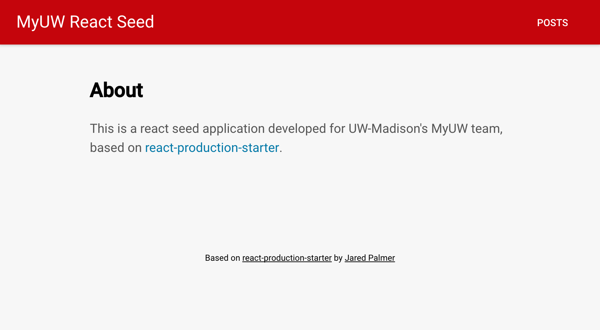

# MyUW React Seed

A react seed application based on [react-production-starter](https://github.com/jaredpalmer/react-production-starter) by Jared Palmer.



### Getting started
```bash
npm install
npm start

# Open localhost:5000
```

#### Dependencies/Components
 - [Node.js](https://nodejs.org/en/)
 - [Express](https://github.com/expressjs/express): Server setup and routing
 - [React](https://github.com/facebook/react)
 - [Redux](https://github.com/reactjs/redux): State managements
 - [React Router](https://github.com/reactjs/react-router) 2.0: URL and UI sychronization
 - [Aphrodite](https://github.com/Khan/aphrodite) by Khan Academy: Colocation of CSS styles with JS components (for [feature-first](https://medium.com/front-end-hacking/the-secret-to-organization-in-functional-programming-913484e85fc9#.ciq01zdgy) organization)
 - [React Helmet](https://github.com/nfl/react-helmet) by the NFL: For meta tags
 - [Redial](https://github.com/markdalgleish/redial) by [@markdalgleish](https://twitter.com/markdalgleish): For data fetching
 - [Babel 6](https://github.com/babel/babel)
 - [Webpack](https://github.com/webpack/webpack) with vanilla Hot Module Replacement

